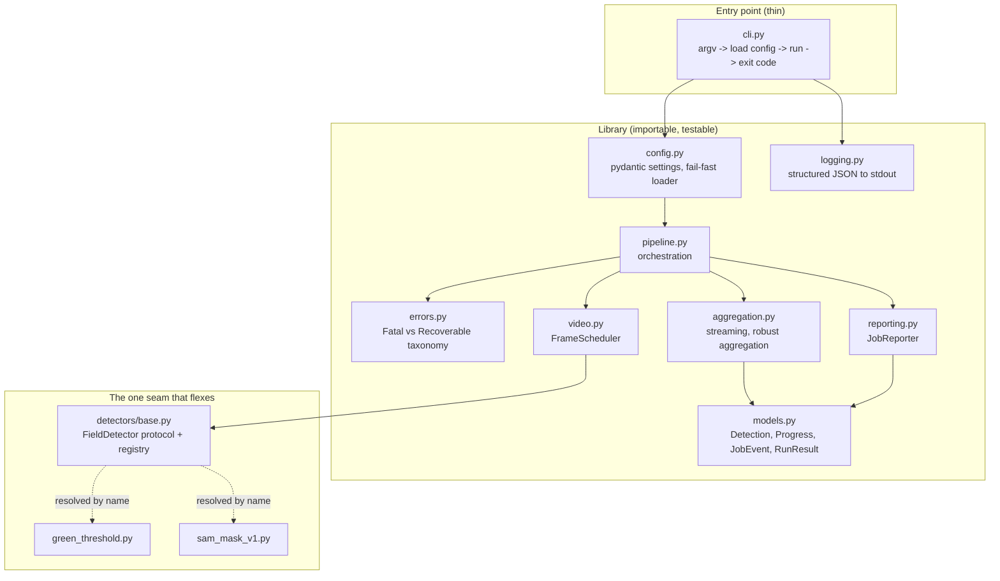

# Architecture

Design notes for the pitch-boundary pipeline. This document is written **before** the
code so the reasoning is reviewable on its own, and so each later commit can be read
against the design it implements.

Reference point throughout: `synthetic_field_prototype.py`, imported unmodified in
`2a85690`. Every decision below is a response to something specific in that script.

---

## 1. What the prototype gets wrong

Not a style critique — each row maps to a concrete risk if this ran unattended on long
feeds. The right-hand column is the assignment part it violates.

| # | Defect | Risk | Part |
|---|---|---|---|
| 1 | Config read via `.get(key, default)`. `sport` falls back to `"soccer"` while the config says `"football"`; `min_area` falls back to `500` while the config says `1000`. | Silent divergence. The shipped file already contradicts itself. | 1.2 |
| 2 | `field_detector.type = "sam_mask_v1"` is never read. Detection is hardcoded to a green HSV threshold. | Dead config. Operators would believe they changed the detector and did not. | 1.3 |
| 3 | `_extract_mask` and `_derive_polygon_from_mask` are two halves of one responsibility. | No seam to swap detectors per sport/deployment. | 1.3 |
| 4 | `except Exception: pass` around contour extraction. | A `TypeError` or `MemoryError` is absorbed as "no boundary found" — a real bug becomes a data gap. | 3.2 |
| 5 | `Polygon([(0,0),(1280,0),(1280,720),(0,720)])` rebuilt every frame, dimensions hardcoded. | Redundant per-frame allocation; wrong for any feed that is not 1280x720. | 2 |
| 6 | `while True: cap.read()` decodes every frame. `target_fps: 30` never used. `time.sleep(0.005)` fake latency. | Cost scales with file length, not with work needed. | 2 |
| 7 | `detected_polygons` accumulates unbounded. | Memory scales with video length. OOM on a long feed. | 2, 3.1 |
| 8 | `cap.isOpened()` failure prints and returns. | **Fatal error exits 0.** Orchestrator sees success. | 3.2 |
| 9 | Mid-stream `ret=False` is indistinguishable from clean EOF. | A truncated/corrupt feed is reported as a completed run. | 3.2 |
| 10 | Invalid polygons silently dropped, uncounted, unreasoned. | No way to tell "no pitch visible" from "detector broke". | 3.3 |
| 11 | `print()` is the only observability. Nothing is reported over the network. | Unattended batch job with no monitorable state. | 3.1, 4 |
| 12 | `crop_search` config block is entirely unused (README confirms crop layout is unimplemented). | Config advertises capability that does not exist. | — |

---

## 2. Target architecture



**Dependency rule:** `pipeline.py` depends only on abstractions it defines or imports
from `detectors/base.py`. It never imports a concrete detector, never imports
`requests`, and never touches `argparse`. Wiring happens once, in `cli.py`.

This is what makes the pipeline testable without a video file, a network, or OpenCV's
detector behaviour.

---

## 3. Module responsibilities

| Module | Owns | Explicitly does not own |
|---|---|---|
| `config.py` | Loading, parsing, validating, and reporting config errors | Any defaulting or coercion beyond declared validators |
| `models.py` | The data shapes that cross boundaries (detections, progress, events, results) | Business logic |
| `errors.py` | The exception hierarchy and its mapping to exit codes | Catching anything itself |
| `logging.py` | Log record shape, run correlation id | Deciding what is fatal |
| `video.py` | Deciding *which* frames to decode and yielding them | Interpreting frame content |
| `pipeline.py` | Sequencing, counters, policy (fatal vs. continue), final result | Concrete detection, concrete transport |
| `aggregation.py` | Turning per-frame observations into a final robust summary | Reading video |
| `reporting.py` | Getting validated payloads to the platform, tolerating failure | Failing the run |
| `detectors/*` | Turning one frame into zero or one boundary | Anything about video, config files, or transport |

---

## 4. The one seam

The assignment warns against a plugin system on every class, so exactly one interface
is abstracted. Everything sport- and deployment-specific collapses behind it:

```
FieldDetector.detect(frame: np.ndarray) -> FieldDetection | None
```

`FieldDetection` carries the polygon, a confidence value, and the detector id that
produced it — so a rejected or accepted detection can always be traced to its source.

Design choices:

- **One method, not three.** The prototype's two-step `_extract_mask` then
  `_derive_polygon_from_mask` is an implementation detail of *one* detector, not a
  contract. A future learned model returns a polygon directly and has no mask step.
- **`None` means "no boundary in this frame".** That is a normal, expected outcome on
  close-ups. It is distinct from raising.
- **Resolved by name from config.** `field_detector.type` is validated against the
  registry at config-load time, so an unknown detector is a startup failure rather
  than a runtime surprise. The dead `type` key from the prototype becomes load-bearing.
- **Per-detector config is a discriminated union** on `type`, so each implementation
  validates its own parameters (`min_area` for the threshold detector, model path and
  confidence for a future one) instead of a shared untyped bag.

Deliberately **not** abstracted: video reading, aggregation, reporting. Each has one
real implementation today. Abstracting them would add indirection without buying a
second case, which is the failure mode the assignment calls out.

---

## 5. Processing efficiency (Part 2)

The requirement is that cost scales with *how much of the video needs inspecting*, not
with file length. Two separate costs, handled separately.

### 5.1 Don't decode what you don't analyze

A `FrameScheduler` reads the stream's real `CAP_PROP_FPS` and `CAP_PROP_FRAME_COUNT` and
computes `stride = ceil(source_fps / target_fps)` — finally making `target_fps`
meaningful instead of decorative.

Skipped frames advance with **`cap.grab()`**, not `cap.read()`. `read()` is
`grab()` + `retrieve()`; `retrieve()` is the expensive decode-to-BGR step. Advancing
without retrieving avoids that cost entirely. Measurable win at 50/60 fps sources,
larger as source framerate grows.

Note the honest limitation: `grab()` still demuxes, and on inter-frame codecs you cannot
truly skip decoding to a non-keyframe. Frame-accurate seeking via
`CAP_PROP_POS_FRAMES` is not reliable across codecs. This is a real reduction in work,
not a free lunch — recorded in `DECISIONS.md`.

### 5.2 Amortise expensive repeated work

- **Hoist loop constants.** The frame-boundary polygon moves out of the loop, and is
  derived from the *actual* frame dimensions read from the stream rather than the
  hardcoded `1280x720`.
- **Build detector constants once,** in `__init__` — HSV bound arrays, kernel sizes.
  The prototype rebuilds `np.array([35, 40, 40])` and friends on every single frame.
- **Cheap rejects before expensive work.** `max(contours, key=cv2.contourArea)` computes
  each contour's area, then the code builds a `Polygon` and does a Shapely intersection.
  Replaced with: one area pass, reject below `min_area` *before* polygon construction or
  spatial maths. Noise frames — which the generator injects deliberately — now cost
  almost nothing.
- **Streaming aggregation instead of accumulation.** The unbounded
  `detected_polygons` list is replaced by running statistics and a bounded ring buffer.
  Memory becomes O(1) in feed length instead of O(frames).
- **Delete the fake latency.** `time.sleep(0.005)` modelled per-frame detector cost;
  the real detector provides it.

### 5.3 Optional convergence early-exit

Off by default, enabled by config. Once `min_valid_samples` are collected and the
running metric's relative standard error drops below a threshold, processing stops.
This is the only mechanism that makes a *longer* feed genuinely cheaper for the *same*
analysis, so it is worth having — but it is a correctness trade-off, not a pure win, so
it never turns itself on.

---

## 6. Failure handling (Part 3)

### 6.1 Taxonomy

Every failure is classified once, in `errors.py`. Nothing is caught without being
classified.

| Class | Examples | Policy | Exit |
|---|---|---|---|
| `ConfigError` | unparsable YAML, `confidence_threshold: 5`, unknown detector type, unknown key | **Fatal, before any I/O** | 2 |
| `InputError` | file missing, `cap.isOpened()` false, zero frames | **Fatal** | 3 |
| `StreamError` | mid-stream `ret=False` before `frame_count`, repeated decode failure | **Fatal** — feed is truncated | 4 |
| `DetectionRejected` | empty mask, <3 points, degenerate or self-intersecting polygon, `area < min_area` | **Recoverable**, counted with a reason | — |
| `ReportingError` | connection refused, timeout, non-2xx | **Never fatal**, logged, retried, run continues | — |
| `UnexpectedError` | anything unclassified | **Fatal**, traceback logged, never absorbed | 1 |

The prototype's `except Exception: pass` is replaced by a narrow
`except (cv2.error, ValueError, GeometryError)` around the geometry step alone.
Anything else propagates — a real bug must never be reclassified as a data gap.

### 6.2 Distinguishing truncation from clean EOF

The prototype treats `ret=False` as "video finished". Before concluding that, the
scheduler compares frames actually read against `CAP_PROP_FRAME_COUNT`. If the stream
ends materially early, or a decode error repeats, that is a `StreamError` — the run is
truncated and must not be reported as a success.

### 6.3 Noisy frames and aggregation

Per frame: valid detection, or a rejection with a reason. Nothing else. Invalid frames
are **counted and reason-tagged**, never silently dropped — that is what makes "no pitch
visible" distinguishable from "detector broke".

Final output, from `aggregation.py`:

- counts: frames read, analyzed, skipped, valid, rejected (by reason)
- coverage ratio: `valid / analyzed`
- the spatial metric aggregated as **median and IQR, not mean** — the generator injects
  false-positive rectangles on purpose, and a mean would let them drag the headline
  number
- a consensus boundary polygon, plus the count of frames supporting it
- all-invalid is an explicit, non-crashing outcome with its own status and exit code

### 6.4 Observability

- One JSON object per line on stdout, carrying `run_id`, `level`, `event`,
  `frame_index`, `elapsed_ms`. Machine-readable because nobody is watching a console.
- Periodic progress reports to the platform every N frames or T seconds.
- Terminal events: `run.started`, `run.completed`, `run.failed` with a reason code and
  the aggregated result, so a failure is diagnosable after the fact from logs plus the
  platform.

---

## 7. Reporting (Part 4)

Payloads are built from pydantic models in `models.py` — the same family used for
config — and serialised from those models. No dict assembled by hand anywhere near the
wire.

The two failure directions are kept rigorously separate:

| Situation | Pipeline | Reporting | Exit code |
|---|---|---|---|
| Everything fine | succeeds | succeeds | 0 |
| Platform unreachable | **still succeeds** | degrades, retries with backoff, breaker opens, drops counted | 0, result flagged `reporting_degraded` |
| Pipeline fails | fails | best-effort `run.failed` event attempted before exiting | the *pipeline's* code (2/3/4/1) |

Two rules enforce this:

1. `ReportingError` is caught **inside** `reporting.py` and returned as a status value.
   It never propagates into the pipeline's fatal path, so a broken endpoint cannot fail
   a healthy run.
2. A failure to report a failure never masks the original. The exit code is decided by
   the pipeline outcome first; reporting is attempted afterwards on a best-effort basis.

Timeouts are short and retries bounded, because stalling a batch job on a telemetry
endpoint is the wrong default. Startup does a short bounded readiness probe and then
proceeds regardless.

---

## 8. Configuration

`config/default.yaml` declares every field explicitly — no implicit defaults to fall
back to. The loader:

1. reads the file; a parse error is a `ConfigError` naming file and line
2. validates against the pydantic model with `extra="forbid"`
3. raises `ConfigError` with the offending key path and the rejected value
4. exits 2 before any video is opened

`extra="forbid"` is a deliberate trade-off: a typo'd key fails loudly instead of being
ignored. The cost is that adding a field is not backward compatible for older runners.
Recorded in `DECISIONS.md`.

Environment overrides (`TRACKBOX_VIDEO_PATH`, `TRACKBOX_API_URL`) are validated through
the same model — an override is not a bypass.

---

## 9. Exit codes

| Code | Meaning |
|---|---|
| 0 | Completed successfully |
| 1 | Unexpected internal error |
| 2 | Configuration error |
| 3 | Input error (missing, unreadable, empty) |
| 4 | Stream error (truncated or corrupt feed) |
| 5 | Completed but no valid boundaries found |

Deliberately distinct from one another: an orchestrator must be able to tell "bad
config" from "bad video" from "ran fine, saw no pitch" without parsing text.

---

## 10. Testing

| File | Covers |
|---|---|
| `test_config.py` | valid load; unknown key, bad type, out-of-range, malformed YAML, unknown detector — each asserts fail-fast, not fallback |
| `test_detectors.py` | green detector on synthetic green / noise / blank frames; registry resolves by name; unknown name fails |
| `test_scheduler.py` | stride arithmetic; skipped frames genuinely skipped; expected indices on a fixture |
| `test_aggregation.py` | median resists injected outliers; all-invalid yields the defined outcome; streaming stats match a batch computation |
| `test_reporting.py` | success; timeout degrades rather than fails; 5xx retried; breaker opens; payload validates |
| `test_pipeline.py` | end-to-end on a short generated video with a fake reporter; exit-code taxonomy; failures never silently absorbed |

The pipeline tests use a fake reporter and a fake detector, proving the seam works for
testing as well as for production flexibility.

---

## 11. Known limitations and open questions

Carried forward into `DECISIONS.md`, but flagged here so they are not discovered late:

1. **Frame sampling vs. exhaustiveness.** Sampling at `target_fps` means not every frame
   is classified. If a downstream consumer needs per-frame guarantees, this design is
   wrong and needs revisiting with the product team.
2. **Mid-stream resolution change.** Multi-camera cuts to a different resolution are not
   handled; the plan is to detect the change and fail fast rather than silently mix
   coordinate spaces.
3. **Crop layout scope.** The README describes the boundaries as feeding a downstream
   crop-layout step that is "not yet implemented"; Parts 1–4 never explicitly require
   it. Aggregation is implemented; crop suggestion is left as a documented stub behind
   the same seam unless told otherwise.
4. **Truncated-feed policy.** Abort (exit 4) is the chosen default, with partial results
   attached. An alternative is to process the prefix and mark it degraded — needs a
   product decision.
